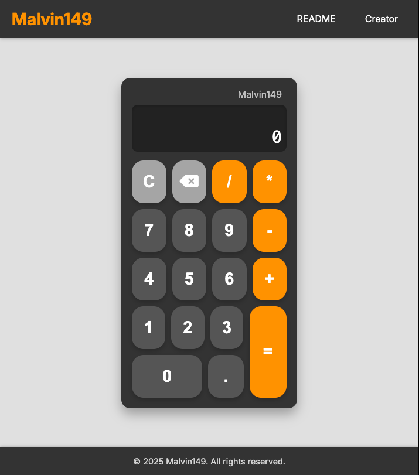

# Calculator App 

## Overview
This is a simple, yet robust, web-based calculator application designed to perform basic arithmetic operations. It features a clean, intuitive user interface and supports both mouse clicks and keyboard input for a seamless user experience.

#### Live Demo / Screenshot

[:rocket: Try the calculator Live!](https://malvin149.github.io/js-calculator/)



### Features

- **Basic Arithmetic Operations:** Perform addition, subtraction, multiplication, and division.

- **Chaining Operations:** Seamlessly chain multiple operations (e.g., 5 + 3 - 2).

- **Decimal Support:** Handle calculations involving decimal numbers.

- **Clear Functionality:** Reset the calculator to its initial state with a "C" button.

- **Delete/Backspace:** Remove the last digit entered with a "DEL" button.

- **Error Handling:** Displays "Math Error" for invalid operations, such as division by zero.

- **Input Validation:** Prevents multiple decimal points in a single number and handles premature equals button presses.

- **Result Rounding:** Automatically rounds long decimal results to prevent display overflow.

- **Display Overflow Handling:** Displays "OVERFLOW" for numbers too large to fit the display, preventing unreadable scientific notation.

- **Keyboard Support:** Full functionality via keyboard, including digits, operators, Enter (for equals), Backspace (for delete), and 'c'/'C' (for clear).


### How to Use
1. Clone the Repository (if applicable):

```
git clone https://github.com/malvin149/js-calculator.git
```
2. Open `index.html`: Simply open the `index.html` file in your web browser (e.g., Chrome, Firefox, Edge).

3. Interact:

- **Mouse:** Click the number, operator, and function buttons on the calculator interface.
- **Keyboard:** 
 - **Digits (0-9), Decimal (.):** Press the corresponding keys.
 - **Operators (`+,-,*,/`):** Press the corresponding keys (including numpad or Shift combinations if applicable).
 - **Equals (=):** Press `=` or `Enter`.
 - **Clear (C):** Press `c` or `C` (or `Escape`).
 - **Delete (DEL):** Press `Backspace` or `Delete`.


### Technologies Used

- **HTML5:** For the structure and content of the calculator interface.
- **CSS3:** For styling and layout, ensuring a responsive and bisually appealing design.
- **JavaScript (ES6+):** For all the interactive logic, arithmetic operations, and state management.
- **Font Awesome:** Used for the delete/backspace icon.
- **Google Fonts:** For custom typography (e.g., 'inter', 'Roboto Mono').

### License 

This project is open source and available under the [MIT License]().
